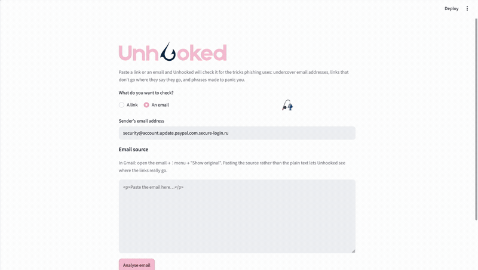

# Unhooked

A phishing detector for links and emails. Paste a URL or an email and it reports
a risk score and a list of what looks wrong.



## The idea

Phishing pages are easy to make look convincing, since a design can be copied in
an afternoon using AI. A **domain name can't**. Registering `paypal.com` is
impossible; the best an attacker can do is something that *resembles* it:
`paypal-account-verify-secure.com`, or
`account.update.paypal.com.secure-login.ru`, or hiding the real destination
behind an `@`.

So Unhooked ignores how a message *looks* and examines structure instead, where
a link actually goes, and how the sender's domain is put together.

## What it checks

In a URL or a sender's domain:

- a raw IP address instead of a domain name, like `http://192.168.1.1/login`
- an `@` hiding the real host, so `paypal.com@evil.ru` reads as PayPal but goes
  to `evil.ru`
- too many subdomains, since `account.update.paypal.com.secure-login.ru` is
  really just `secure-login.ru` with brand names stacked in front
- too many hyphens, like `paypal-account-verify-secure.com`

In an email:

- links where the visible text claims one domain and the `href` goes somewhere
  else
- urgent wording like "suspended", "within 24 hours" or "confirm your identity"

I use [tldextract](https://github.com/john-kurkowski/tldextract) to pull out the
registered domain, because counting hyphens myself flagged
`s3.eu-west-2.amazonaws.com`, which is a real Amazon address. The hyphens are in
Amazon's subdomain and the registered domain is just `amazonaws.com`.

## Scoring

Each domain problem is worth 1 point. Urgent wording is only worth 0.5, because
a real email can say "urgent" but a scammer still can't register the domain they
want. So a normal email that shouts URGENT scores 0.5, which flags it without
calling it phishing.

The result also includes the list of reasons, so you can always see which check
fired instead of just a number.


## See it work

A URL hiding its real destination behind an `@`, with fake subdomains in front:


Not flagging normal things matters just as much. A real BBC link and a real BBC
newsletter, both left alone:


## Install

```bash
git clone https://github.com/KatiutaMicuta/Unhooked.git
cd Unhooked
python3 -m venv .venv
source .venv/bin/activate
pip install -r requirements.txt
```

## Use it

Web interface:

```bash
streamlit run app.py
```

Command line:

```bash
python main.py
```

## Tests

```bash
python -m pytest
```

23 tests, covering each rule with an example that should trigger it and one that
shouldn't. Two of them are there because of bugs I hit: the Amazon false
positive, and a crash on `<a>` tags with no `href` at all.

## Layout

```
src/url_analyzer.py     URL checks
src/email_analyzer.py   email checks
tests/                  pytest suite
app.py                  Streamlit interface
main.py                 command line interface
```

## Known limitations

- The command line version reads the email body with `input()`, which stops at
  the first newline, so multi-line HTML has to go in the web interface instead.
- Pasting an email as plain text throws away the `href` attributes, so link
  checking gets skipped. The app says so instead of just reporting "clean".
- The urgent wording list is English only.
