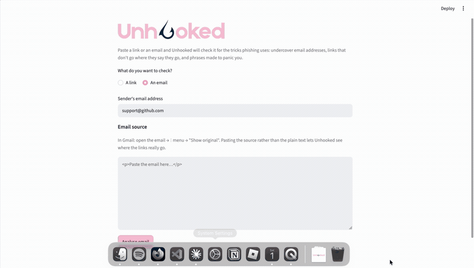
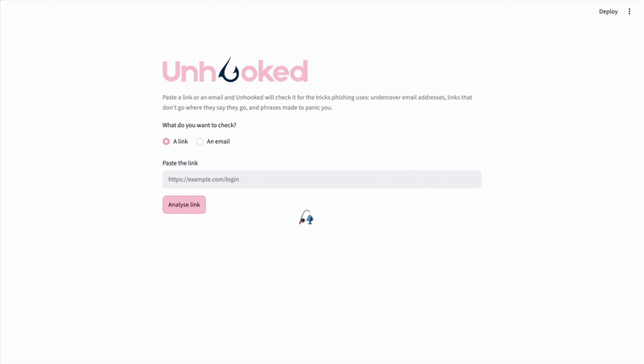
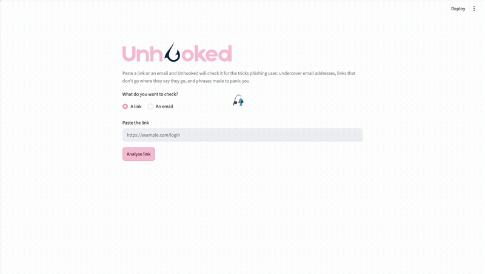
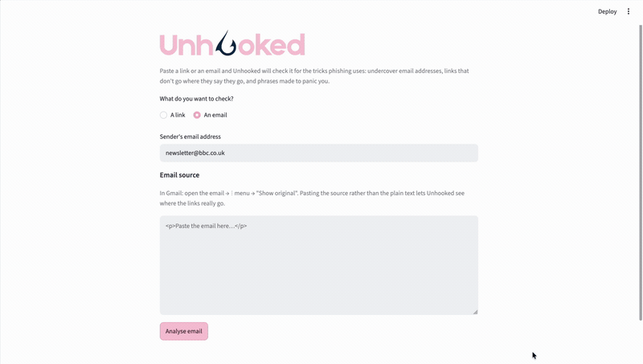

# Unhooked

A phishing detector for links and emails. Paste a URL or an email and it reports
a risk score plus a plain-English list of what looks wrong.


## The idea

Phishing pages are easy to make look convincing — a design can be copied pixel
for pixel in an afternoon. A **domain name cannot**. Registering `paypal.com` is
impossible; the best an attacker can do is something that *resembles* it:
`paypal-account-verify-secure.com`, or
`account.update.paypal.com.secure-login.ru`, or hiding the real destination
behind an `@`.

So Unhooked ignores how a message *looks* and examines structure instead, where
a link actually goes, and how the sender's domain is put together.

## What it checks

**Domain structure**:

| Check | Flags |
|---|---|
| `uses_ip_address` | A raw IP instead of a domain name — `http://192.168.1.1/login` |
| `has_userinfo` | An `@` hiding the real host — `paypal.com@evil.ru` reads as PayPal but goes to `evil.ru` |
| `has_many_subdomains` | Padded labels faking a brand — `account.update.paypal.com.secure-login.ru` is really just `secure-login.ru` |
| `has_many_hyphens` | Keyword-stuffed lookalikes — `paypal-account-verify-secure.com` |

**Email content** (softer evidence — cheap to fake):

| Check | Flags |
|---|---|
| `link_mismatch` | A link whose visible text claims one domain while its `href` points at another |
| `urgent_language` | Pressure wording: *suspended*, *within 24 hours*, *confirm your identity* |

Registered domains are extracted with
[`tldextract`](https://github.com/john-kurkowski/tldextract), which uses the
Public Suffix List. That matters: naive counting would flag
`s3.eu-west-2.amazonaws.com` as hyphen-stuffed, when the hyphens are in Amazon's
subdomain and the registered domain is simply `amazonaws.com`.

## Scoring

Structural flags are worth **1 point** each. Urgent language is worth **0.5**,
because a legitimate email can reasonably say "urgent" — but a scammer cannot
cheaply register the domain they want. A clean sender that shouts URGENT scores
0.5: flagged, not condemned.

Every result also carries a `reasons` list, so the score is never the whole
answer — you can always see *which* check fired.



## See it work

A URL hiding its real destination behind an `@`, with fake subdomains stacked in
front of it:



Not crying wolf matters just as much. A real BBC link and a real BBC newsletter,
both left alone:





## Install

```bash
git clone https://github.com/KatiutaMicuta/Unhooked.git
cd Unhooked
python3 -m venv .venv
source .venv/bin/activate
pip install -r requirements.txt
```

## Use it

Web interface:

```bash
streamlit run app.py
```

Command line:

```bash
python main.py
```

## Tests

```bash
python -m pytest
```

23 tests covering every rule in both directions, plus regression tests for two
specific bugs: the AWS false positive, and a crash on `<a>` tags with no `href`.

## Layout

```
src/url_analyzer.py     URL heuristics + url_analysis aggregator
src/email_analyzer.py   email heuristics + email_analysis aggregator
tests/                  pytest suite
app.py                  Streamlit interface
main.py                 command-line interface
```

## Known limitations

- The CLI reads the email body with `input()`, which stops at the first newline,
  so multi-line HTML has to be pasted into the web interface instead.
- Pasting an email as plain text discards the `href` attributes, so link checking
  is skipped — the app says so rather than silently reporting "clean".
- The urgency keyword list is English only.
